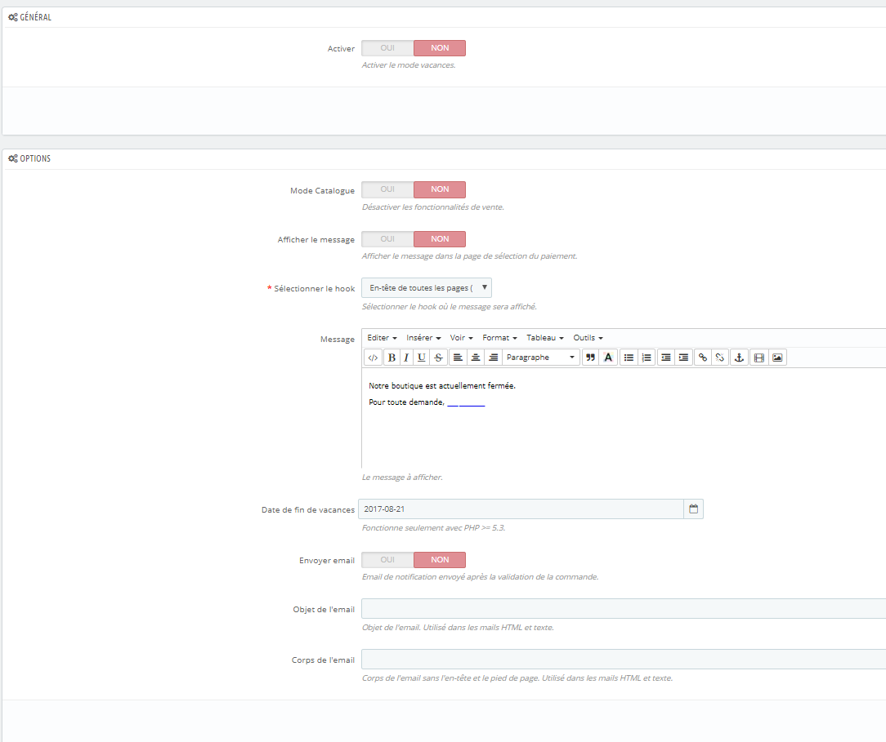

Mode Vacances / Holidays Mode
============

Prestashop v1.5.0.2 - v1.6+

---

**FRENCH**

*Ce module permet de passer la boutique en mode vacances.*

Les fonctionnalités sont les suivantes (chaque option peut être désactivée indépendamment) :

* Activer le mode catalogue
* Afficher un message dans la page de sélection des paiements
* Envoyer un email lors de la validation d'une commande
* Pris en compte d'une date de retour (PHP >= 5.3)
* Prise en charge de la localisation

---
**ENGLISH**

*This module allow to set the store in holidays mode.*

The features are as follows (each option can be disabled independently) :

* Enable the catalog mode
* Display a message in the payment selection page 
* Send an email when at the validation order
* Support for a returning date (PHP >= 5.3)
* Support for localization 

---

*Changelogs*

* v1.0.0 : Create module
* v1.1.0 : Add module compliant with Prestashop versions 1.5.0.2 to 1.6+
* v1.2.0 : Add ability to choose the hook where the message will be displayed
* v1.3.0 : Add ability to set a returning date
* v1.3.1 : Display the returning date in the current date format

*Contributors*

* @okom3pom - https://github.com/okom3pom

https://www.prestashop.com/forums/topic/335824-module-gratuit-mode-vacances/
